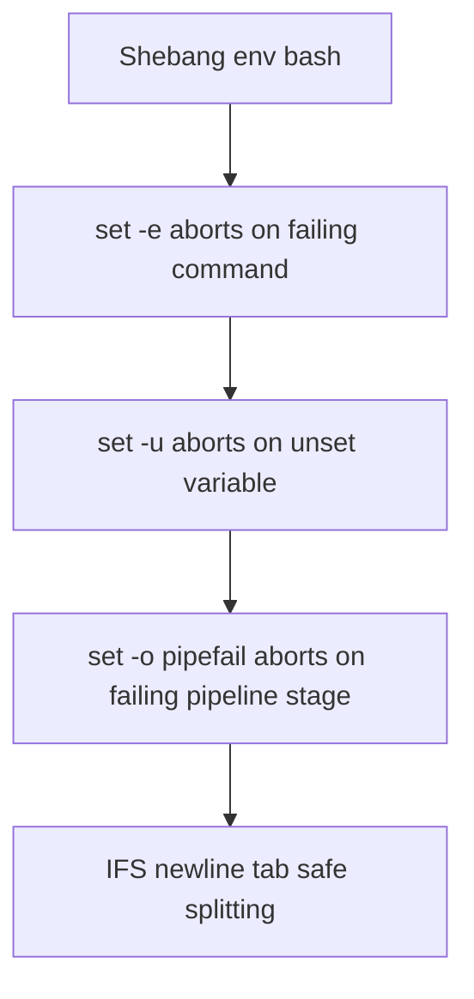
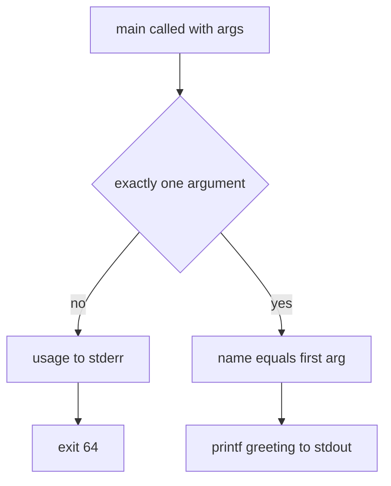

# Lecture 1 — `set -euo pipefail` and Quoting

> **Duration:** ~3 hours. **Outcome:** Every script you write from this point forward opens with the same four lines; you quote every variable without thinking; you read a shell snippet and spot the word-splitting bug in under five seconds; ShellCheck stops finding the easy things in your code.

Bash is a language designed for typing at a prompt. The features that make it pleasant interactively — implicit word-splitting, glob expansion, silent failure of commands you don't care about — become liabilities the moment you save a sequence of commands to a file and call it a script. This lecture is about the half-dozen defaults you must change before your script crosses the line from "what I type" to "what runs at 3am while I sleep."

Read it at the keyboard. Every example below has a wrong-vs-right pair, and the right-hand version is the one you will write going forward.

## 1. The shebang and the strict-mode opener

Every script begins identically. Memorize this:

```bash
#!/usr/bin/env bash
set -euo pipefail
IFS=$'\n\t'
```

Four lines. Type them at the top of every new script for the rest of your career. We'll unpack each.



*The four-line strict-mode opener, and the bug class each line guards against.*

### 1.1 The shebang: `#!/usr/bin/env bash`

The first line tells the kernel which interpreter to run. There are two competing forms in the wild:

```bash
#!/bin/bash               # absolute path. Works on Linux. Fails on systems where bash lives elsewhere.
#!/usr/bin/env bash       # PATH-resolved. Works wherever bash is on $PATH.
```

We use `#!/usr/bin/env bash`. Reasons:

- On macOS, the default `/bin/bash` is **Bash 3.2 from 2007** (Apple stopped updating at the last GPL-2 release). Homebrew installs a modern Bash, typically at `/opt/homebrew/bin/bash` on Apple Silicon or `/usr/local/bin/bash` on Intel — neither is `/bin/bash`. The `env` form finds the modern one if it's first on `$PATH`.
- On NixOS, Alpine, and a few BSDs, Bash lives in non-standard locations. The `env` form is portable.
- The cost of the `env` form is one extra exec at startup. On any machine built in the last 20 years, this is measured in microseconds. Don't optimize this.

The one place `#!/bin/bash` is preferable: setuid scripts (which Linux ignores anyway, see Week 3) and `cron` jobs on minimal embedded systems with no `/usr/bin/env`. For the scripts you write this week, `env bash` is the rule.

### 1.2 `set -e` — exit on error

```bash
set -e
```

Bash, by default, **ignores command failures**. A script that does:

```bash
#!/usr/bin/env bash
mkdir /var/lib/myapp           # fails (permission denied), prints to stderr
cp config.json /var/lib/myapp/ # fails (parent doesn't exist), prints to stderr
echo "Setup complete!"          # prints "Setup complete!" to a user who now believes the lie
```

…will print "Setup complete!" even though every command before it failed. With `set -e`, the script aborts at the first non-zero exit:

```bash
#!/usr/bin/env bash
set -e
mkdir /var/lib/myapp           # fails — script exits here, returning 1
cp config.json /var/lib/myapp/ # never runs
echo "Setup complete!"          # never runs
```

This is the most important single line in a defensive Bash script. It is also the most-misunderstood. **`set -e` has surprising holes.** Specifically, it does *not* abort:

- When a failing command is part of an `if`, `while`, `until` condition, or follows `&&` / `||`.
- When a function called from within `set -e` itself returns non-zero — depending on Bash version and POSIX-mode flags, this case is subtle.
- When a command failure happens **inside a pipeline** that isn't the last command. (That's what `set -o pipefail` fixes — see below.)

The "this is in an `if`" exemption is intentional and useful — you write `if grep -q foo file; then ...` precisely because `grep` can legitimately return 1 when the pattern is absent. But the function-return case has caused real production incidents, and is part of why ShellCheck exists. Read BashFAQ #105: <https://mywiki.wooledge.org/BashFAQ/105>.

### 1.3 `set -u` — error on unset variable

```bash
set -u
```

By default, an undefined variable in Bash expands to the empty string. This is the source of one of the most catastrophic bugs in scripting history:

```bash
# WRONG: typo in $TARGET_DIR (TYPED $TARGT_DIR), set -u not enabled
rm -rf "$TARGT_DIR/"     # rm -rf "/" — yes, really
```

Steam famously shipped a Bash uninstaller that did approximately this on Linux in 2015. With `set -u`, the typo becomes:

```bash
# RIGHT: same typo, but set -u enabled
set -u
rm -rf "$TARGT_DIR/"
# bash: TARGT_DIR: unbound variable — script exits before running rm
```

The cost of `set -u` is that you now must explicitly handle optional variables. The form is:

```bash
# WRONG (under set -u): silently uses empty string if FOO unset
echo "FOO is: $FOO"

# RIGHT: explicit default
echo "FOO is: ${FOO:-not set}"
```

The `${VAR:-default}` syntax is the **parameter expansion default**. Read `man bash`, section "Parameter Expansion," for the full family (`:-`, `:=`, `:?`, `:+`). You will use `:-` constantly under `set -u`.

### 1.4 `set -o pipefail` — pipeline exit status

```bash
set -o pipefail
```

By default, a pipeline's exit status is **the exit status of the last command** — every other command's success or failure is discarded. This is wrong far more often than it's right:

```bash
# WRONG: without pipefail
curl -sf https://example.com/data.json | jq '.count' > count.txt
# If curl fails (404, network error), it prints nothing.
# jq runs on empty input, prints "null", exits 0.
# Pipeline exits 0. The script believes it succeeded.
```

With `pipefail`, the pipeline's exit is the **rightmost non-zero exit**, or zero if all commands succeeded:

```bash
# RIGHT: with pipefail
set -o pipefail
curl -sf https://example.com/data.json | jq '.count' > count.txt
# If curl fails, the pipeline exits with curl's exit code.
# Combined with set -e, the script aborts immediately.
```

Combined with `set -e`, this means a pipe failure in any stage anywhere in your script aborts the run. This is the discipline you want.

### 1.5 `IFS=$'\n\t'` — the safe field separator

```bash
IFS=$'\n\t'
```

`IFS` is the **Internal Field Separator** — the set of characters Bash uses to split unquoted strings into words. The default is space, tab, newline. This is fine for most cases, but it has one ugly consequence: it splits filenames that contain spaces, like `My Documents` or `John's Files`.

Setting `IFS=$'\n\t'` removes the space from the splitter. Now, even if you do unquoted expansions (which you shouldn't — see §2), filenames with spaces survive intact across loops. It's belt-and-suspenders defense.

You will see scripts that omit this line — including the original "strict mode" essay by Aaron Maxwell. Both forms are defensible. We include it because it has saved us repeatedly when reviewing other people's code that wasn't fully quoted.

## 2. Quoting — the most-missed lesson

If you internalize one habit this week, internalize this: **every variable expansion is quoted, every command substitution is quoted, every glob you don't mean to expand is escaped.**

The default in Bash is to split and glob the result of every unquoted expansion. This is the right behavior for an interactive shell, where you want `ls *.txt` to expand the glob. It is the wrong behavior almost everywhere in a script.

### 2.1 The four canonical word-splitting bugs

#### Bug 1: `for f in $(ls)`

```bash
# WRONG
for f in $(ls /var/log); do
    process "$f"
done
```

This is **BashPitfalls #1**. Pitfalls:

- `ls` output is for humans, not machines. It doesn't handle filenames with spaces, newlines, or unusual characters. (`ls` on a file named `report 2024.txt` produces one word with a space in it; the loop sees two words: "report" and "2024.txt".)
- The `$(ls)` expansion is unquoted, so word-splitting and globbing apply. Filenames with `*` or `?` in them get re-globbed.

The right form uses a glob directly:

```bash
# RIGHT
for f in /var/log/*; do
    process "$f"
done
```

This works because the glob is expanded by Bash itself, after which each filename — including those with spaces — is one word. The `"$f"` inside the loop body is quoted, so the value passes intact.

If the glob might match nothing, set `shopt -s nullglob` or check with `[[ -e $f ]]`.

#### Bug 2: `if [ $foo = "bar" ]`

```bash
# WRONG
if [ $foo = "bar" ]; then
    ...
fi
```

If `$foo` is empty or unset, this becomes `if [ = "bar" ]` — a syntax error. If `$foo` contains spaces, like `hello world`, it becomes `if [ hello world = "bar" ]` — also a syntax error, four arguments where `[` expected three.

The fix has two parts: quote, and use `[[ ]]`:

```bash
# RIGHT
if [[ "$foo" == "bar" ]]; then
    ...
fi
```

Inside `[[ ]]`, word-splitting is **suppressed**. Quoting is still good practice, but `[[ $foo == "bar" ]]` also works without breaking. Inside `[ ]` (the POSIX `test`), you must quote — there's no protection.

We will cover the full `[[ ]]` versus `[ ]` story in §3.

#### Bug 3: `cat file | while read line`

```bash
# WRONG-ish
cat file.txt | while read line; do
    process "$line"
done
```

Two problems. Subtle first:

- Each pipeline stage runs in a **subshell**. Variables modified inside the `while` loop (e.g., a counter) do not survive after the loop. This bites people who try to compute a sum and `echo` it later.

Obvious second:

- `read` without `-r` interprets backslashes as escape characters. A line like `path\with\backslashes` loses its backslashes.
- `read` without setting `IFS=` strips leading and trailing whitespace.

The right form:

```bash
# RIGHT
while IFS= read -r line; do
    process "$line"
done < file.txt
```

Three changes: `IFS=` to keep whitespace, `-r` to keep backslashes, and **redirect from the file** instead of piping. The redirect keeps the loop body in the current shell, so variables persist. ShellCheck flags the wrong form as `SC2002` ("useless `cat`") and `SC2162` ("read without `-r`").

#### Bug 4: `rm -rf $DIR/`

```bash
# WRONG
rm -rf $DIR/
```

If `$DIR` is empty or unset, this becomes `rm -rf /` — every file on the system, if you're root. The same flavor of bug as the Steam disaster.

The fix is `set -u` (so unset variables abort), the double quote (so empty variables don't disappear into a bare slash), and the parameter-default form if the variable is genuinely optional:

```bash
# RIGHT
set -u
rm -rf "${DIR:?DIR must be set and non-empty}"/
```

The `:?` form prints the message to stderr and exits with non-zero if `$DIR` is unset *or empty*. This is the strongest precondition you can express in pure Bash for "this variable must exist."

### 2.2 The double quote, the single quote, and the dollar curly

Three forms of quoting, three purposes:

```bash
# Double quote: variable expansion happens, glob expansion suppressed, word-splitting suppressed.
echo "Hello, $USER. Today is $(date)."

# Single quote: literal. Nothing expands.
echo 'The variable is named $USER; this prints the dollar sign.'

# Dollar-curly: same as double, with explicit variable boundaries.
echo "Hello, ${USER}_admin."  # without curlies: $USER_admin (different variable)
```

The dollar-curly form matters when the variable name is followed by characters that could be part of a name:

```bash
# WRONG: looks like a variable called USER_admin
filename="$USER_admin.log"

# RIGHT
filename="${USER}_admin.log"
```

It also enables Bash's parameter-expansion operators — defaults (`:-`), substring (`:N:M`), pattern stripping (`#`, `%`), case conversion (`,,`, `^^`), and more. Read `man bash` "Parameter Expansion" with a scratch directory open. You will use `:-`, `##`, and `%%` constantly.

### 2.3 `$@` versus `"$@"` — the only difference that matters

```bash
# WRONG: word-splits each argument
for arg in $@; do echo "$arg"; done

# RIGHT: preserves each argument exactly as the caller passed it
for arg in "$@"; do echo "$arg"; done
```

`"$@"` is a special syntax: the double quotes preserve each positional argument as a separate word, but suppress splitting and globbing on the contents of each one. There is no other Bash construct that behaves this way. **Always use `"$@"` when forwarding arguments.** ShellCheck flags `$@` unquoted as `SC2068`.

The same applies to arrays:

```bash
arr=("hello world" "foo bar")

for x in ${arr[@]}; do echo "$x"; done   # WRONG: prints 4 lines
for x in "${arr[@]}"; do echo "$x"; done # RIGHT: prints 2 lines
```

## 3. `[[ ]]` versus `[ ]` versus `test`

There are three forms of "is this condition true" in Bash. They are not interchangeable.

| Form | What it is | When to use |
|------|------------|-------------|
| `test EXPR` | POSIX builtin | Portable POSIX `sh`; never in modern Bash scripts. |
| `[ EXPR ]` | Same as `test`, with a `]` argument | POSIX shell compatibility. Word-splits its arguments. |
| `[[ EXPR ]]` | Bash compound command | **Default choice in Bash.** No word-splitting, supports `=~` regex, supports `&&`/`\|\|`. |

### 3.1 Five things `[[` does that `[` cannot

#### 1. No word-splitting inside the brackets

```bash
foo=""

[ $foo = "bar" ]     # ERROR: "[: =: unary operator expected"
[[ $foo = "bar" ]]   # WORKS: evaluates false
```

This alone is reason enough to use `[[`. The POSIX `[` is just a regular command; its arguments are word-split before it sees them. The `[[` is a compound command; Bash parses it specially.

#### 2. Pattern matching with `==`

```bash
filename="report.txt"

[[ $filename == *.txt ]]   # TRUE — glob pattern match
[[ $filename == *.csv ]]   # FALSE

[ $filename == *.txt ]     # tests literal string equality with "*.txt" — usually false
```

The pattern is **not quoted** for this to work — quoting the right side turns it into a literal:

```bash
[[ $filename == "*.txt" ]]   # FALSE — literal match of the string "*.txt"
[[ $filename == *.txt ]]     # TRUE  — glob match
```

#### 3. Regex matching with `=~`

```bash
version="1.23.4"

if [[ $version =~ ^[0-9]+\.[0-9]+\.[0-9]+$ ]]; then
    echo "Valid version string."
fi

# Captured groups are in BASH_REMATCH
if [[ $version =~ ^([0-9]+)\.([0-9]+)\.([0-9]+)$ ]]; then
    major="${BASH_REMATCH[1]}"
    minor="${BASH_REMATCH[2]}"
    patch="${BASH_REMATCH[3]}"
fi
```

The right-hand side of `=~` is an **extended regular expression** (ERE), as documented in `regex(7)`. It is **not** quoted; quoting turns it into a literal string. The capturing groups land in `BASH_REMATCH[0]` (the whole match), `[1]`, `[2]`, etc.

#### 4. Native `&&` and `||`

```bash
# WRONG (or at least, fragile)
[ -f "$file" -a -r "$file" ]   # POSIX -a is deprecated; some shells warn

# RIGHT
[[ -f $file && -r $file ]]
```

`[[` lets you write `&&` and `||` inside the brackets, with the same short-circuit semantics you expect from C-family languages. The POSIX `-a` and `-o` operators in `[` are deprecated; don't use them.

#### 5. The empty / unset distinction

```bash
unset foo

[[ -z $foo ]]                 # TRUE  — $foo is empty
[[ -z ${foo+x} ]]             # TRUE  — $foo is unset
[[ -n ${foo+x} ]]             # FALSE — $foo is unset, so ${foo+x} expands to nothing
```

The `${var+value}` form expands to `value` if `var` is **set** (even if empty), and to nothing if it's unset. Pair with `-z` / `-n` to distinguish "empty" from "unset." Under `set -u`, you must use the `${foo+x}` form for the unset test; a bare `$foo` would abort.

### 3.2 When to use `[ ]`

When you're writing a POSIX `sh` script (shebang `#!/bin/sh`) for portability. That's it. For Bash, use `[[`.

The one exception: `[` is required by `make` recipes and `Dockerfile` `RUN` lines because they default to `/bin/sh`. If you're embedding shell in those, either prefix the line with `bash -c '[[ ... ]]'` or stick to `[`. We will hit this in Week 5 with systemd units.

## 4. Reading errors — exit codes

A command's success or failure is its **exit status**, an integer 0–255. The conventions:

| Code | Meaning |
|------|---------|
| 0 | Success. |
| 1 | Generic failure. |
| 2 | Misuse — wrong arguments, missing required flag. |
| 64–78 | `sysexits.h` codes — `EX_USAGE` (64), `EX_DATAERR` (65), `EX_NOINPUT` (66), `EX_NOUSER` (67), `EX_NOHOST` (68), `EX_UNAVAILABLE` (69), `EX_SOFTWARE` (70), `EX_OSERR` (71), `EX_OSFILE` (72), `EX_CANTCREAT` (73), `EX_IOERR` (74), `EX_TEMPFAIL` (75), `EX_PROTOCOL` (76), `EX_NOPERM` (77), `EX_CONFIG` (78). |
| 126 | Command found but not executable. |
| 127 | Command not found. |
| 128+N | Killed by signal N (e.g., 130 = Ctrl-C, which is SIGINT = signal 2). |

The shell stores the previous command's exit in `$?`:

```bash
ls /no/such/dir
echo "Exit was: $?"   # prints 2 on GNU ls (couldn't access)
```

Your scripts should follow the convention. If a script can fail for distinct reasons, return distinct codes. The pattern:

```bash
readonly EX_USAGE=64
readonly EX_NOINPUT=66
readonly EX_UNAVAILABLE=69

if [[ $# -lt 1 ]]; then
    echo "Usage: $0 INPUT" >&2
    exit "$EX_USAGE"
fi
if [[ ! -r $1 ]]; then
    echo "Cannot read: $1" >&2
    exit "$EX_NOINPUT"
fi
```

A caller can `if ./myscript foo; then ...` for success, or check `$?` for the specific failure mode. `exit 1` everywhere throws information away. Don't.

## 5. ShellCheck — the linter you run on every script

ShellCheck is a static analyzer for shell scripts. It catches the bugs that `set -euo pipefail` cannot — specifically, the bugs that don't trigger until a particular value reaches a particular line. It runs locally; install with `apt install shellcheck` or `dnf install ShellCheck`.

Run it on every script you write:

```bash
shellcheck myscript.sh
```

Output is one warning per problem, each tagged with an `SC` code:

```
In myscript.sh line 3:
echo "User is: $USER_admin"
                 ^---------^ SC2154: USER_admin is referenced but not assigned.

In myscript.sh line 5:
for f in $(ls /tmp); do
         ^--------^ SC2045: Iterating over ls output is fragile. Use globs.

In myscript.sh line 10:
rm -rf $DIR/
       ^---^ SC2086: Double-quote to prevent globbing and word splitting.
```

Each code has a wiki page at `https://www.shellcheck.net/wiki/SC2086`, etc. Every page explains the rule, shows the wrong form, and shows the right form. Bookmark the wiki.

ShellCheck **does have false positives** — code that's correct but matches a suspicious pattern. The right response is the `disable` annotation, with a comment explaining why:

```bash
# shellcheck disable=SC2086  # word-splitting is intentional here; $cmd is a controlled internal value
$cmd "$@"
```

The wrong response is `# shellcheck disable=` with no comment. If you can't explain why ShellCheck is wrong, ShellCheck is right.

### 5.1 The ten codes you will see this week

We listed them in [resources.md](../resources.md#shellcheck-error-codes-you-will-see-this-week). The two you will see *most*:

- **SC2086** — "Double-quote to prevent globbing and word splitting." Fix: add `"`.
- **SC2046** — "Quote this to prevent word splitting" (inside `$(...)`). Fix: add `"` around the command substitution.

If you get those two right consistently, you have already fixed the majority of beginner Bash bugs.

### 5.2 ShellCheck as a pre-commit hook

Wire ShellCheck into git so it runs on every commit. Add to `.git/hooks/pre-commit`:

```bash
#!/usr/bin/env bash
set -euo pipefail
git diff --cached --name-only --diff-filter=ACM | grep -E '\.(sh|bash)$' | while IFS= read -r f; do
    shellcheck "$f" || exit 1
done
```

`chmod +x .git/hooks/pre-commit`. Now `git commit` blocks if any staged shell script has warnings. The team-wide version uses `pre-commit` (the Python framework): <https://pre-commit.com/>.

## 6. Putting it together — a minimal defensive script

The "hello defensive world" of Bash:

```bash
#!/usr/bin/env bash
#
# greet.sh — greet a user by name.
#
# Usage:
#   greet.sh NAME
#
# Exit codes:
#   0  — greeted successfully
#   64 — wrong usage (missing argument)

set -euo pipefail
IFS=$'\n\t'

readonly EX_USAGE=64

usage() {
    cat <<'EOF' >&2
Usage: greet.sh NAME

Print "Hello, NAME!" to stdout.
EOF
}

main() {
    if [[ $# -ne 1 ]]; then
        usage
        exit "$EX_USAGE"
    fi
    local name="$1"
    printf 'Hello, %s!\n' "$name"
}

main "$@"
```

Eight elements, all of them this lecture's content:

1. **Shebang** with `env`.
2. **Header comment** with usage and exit codes.
3. **`set -euo pipefail`** + tightened **`IFS`**.
4. **Named exit codes** as readonly constants.
5. **`usage()` function** writing to stderr.
6. **`main()` function** that holds the entry logic.
7. **Quoted positional argument** (`"$1"`) into a `local` variable.
8. **`printf` not `echo`** for output that contains user data — `echo` is unreliable across shells for arguments starting with `-`.



*Control flow inside greet.sh's main function.*

Run ShellCheck on this script. It should be clean.

## 7. The Bash Yellow caution

Three things to internalize before you close this lecture:

- **`set -euo pipefail` is necessary but not sufficient.** It will catch many bugs; it will not catch a missing quote that lets a malicious filename run as a command. Quoting and `[[ ]]` are the second layer.
- **ShellCheck is your code review.** Run it before you ask another human to read your script. Every warning you ignore, you owe the next reader an explanation.
- **Test with a hostile filename.** `touch -- '-rf hello world.txt'` in your scratch directory. If your script copes with that file, your quoting is probably right. If it doesn't, you know where to look.

## 8. Quick recall

After this lecture you should be able to answer, without notes:

- What do `-e`, `-u`, and `-o pipefail` each do? Give one bug each one catches.
- Why is `#!/usr/bin/env bash` preferable to `#!/bin/bash`?
- Why is `for f in $(ls)` wrong? What's the right form?
- What's the difference between `$@` and `"$@"`?
- Inside `[[ ]]`, what does `==` mean that it doesn't inside `[ ]`?
- What's `BASH_REMATCH` and when is it populated?
- What does ShellCheck warning `SC2086` mean?

If you stalled on any of these, re-read the relevant section before moving to Lecture 2.

---

*Next: [Lecture 2 — Functions and trap signals](./02-functions-and-trap-signals.md). Cleanup that actually runs, even on Ctrl-C.*
